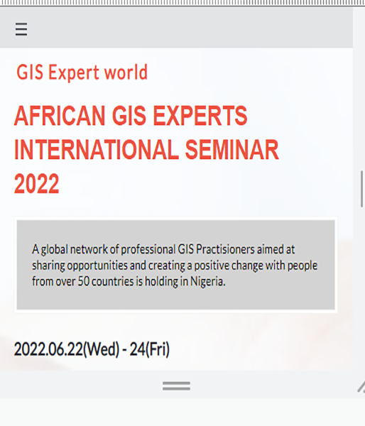

# Capstone-Project
This project is the first capstone project in Module 1, week 5 Microverse curriculum for 2022. It is about designing a website looking like Creative Common Conference but the contents are strictly personalised. All due acknowledgement has been made.

# Mobile-Design

This my Capstone Project in the Module 1 Microverse curriculum.

## Built With

- HTML
- CSS
- JS

## Live Demo

[Live Demo Link](https://www.activegitpages)

## Getting Started

To get a local copy up and running:

1. Clone this repository or download the Zip folder:

**``https://github.com/Smart1-hub``**

1. Navigate to the location of the folder in your machine:

**``you@your-Pc-name:~$ cd <folder>``**

## Author

👤 **Ademola Adebayo**

- Github: [@Ademola](https://github.com/Smart1-hub)

- Twitter: [@ademola_adebayo](https://twitter.com/ademola_adebayo)

- LinkedIn: [Ademola Adebayo](https://www.linkedin.com/in/ademola-adebayo-81051578/)

- Loom: 
https://www.loom.com/share/4bae1adf0d6e49c6afcd492efdf32c24

## Design By

👤 **Cindy Shin**

- Behance: https://www.behance.net/gallery/29845175/CC-Global-Summit-2015

## Acknowledgement

Microvers Org.
Cindy Shin
All whose codes have been built on

## Contributing

Contributions, issues, and feature requests are welcome!

## Show your support

Give a ⭐ if you like this project and how it is built!

## 📝 License

This project is [MIT](https://github.com/Smart1-hub/Smart Development/blob/add-license-1/LICENSE)

